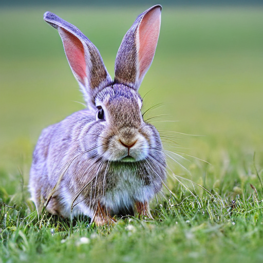
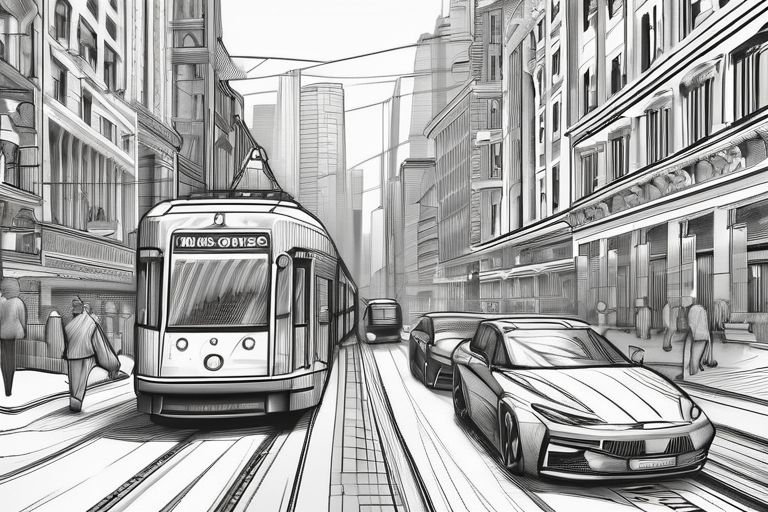

# Prompt Templates for Stable Diffusion

## Purpose of this document
The following prompts are supposed to give an easier entry into getting good results in using [Stable Diffusion](https://github.com/CompVis/stable-diffusion). Simple prompts can already lead to good outcomes, but sometimes it's in the details on what makes an image believable. The following prompts are all either collected from different discord servers or fabricated by myself.

| Category              | Prompt                                                                                                                                                                                                                                                                                                                                                                                                                          | Example                                                                                                 |
|-----------------------|---------------------------------------------------------------------------------------------------------------------------------------------------------------------------------------------------------------------------------------------------------------------------------------------------------------------------------------------------------------------------------------------------------------------------------|---------------------------------------------------------------------------------------------------------|
| Animal                | `{{Prompt}}`, wildlife photography, photograph, high quality, wildlife, f 1.8, soft focus, 8k, national geographic, award - winning photograph by nick nichols                                                                                                                                                                                                                                                                  |                                 |
| Photograph Closeup    | `{{Prompt}}`, depth of field. bokeh. soft light. by Yasmin Albatoul, Harry Fayt. centered. extremely detailed. Nikon D850, (35mm&#124;50mm&#124;85mm). award winning photography.                                                                                                                                                                                                                                               |         | 
| Archviz               | `{{Prompt}}`, by James McDonald and Joarc Architects, home, interior, octane render, deviantart, greg rutkowski, cinematic, key art, hyperrealism, sun light, sunrays, canon eos c 300, ƒ 1.8, 35 mm, 8k, medium - format print                                                                                                                                                                                                 |                              |
| Building              | `{{Prompt}}`, shot 35 mm, realism, octane render, 8k, trending on artstation, 35 mm camera, unreal engine, hyper detailed, photo - realistic maximum detail, volumetric light, realistic matte painting, hyper photorealistic, trending on artstation, ultra - detailed, realistic                                                                                                                                              |                             |
| Cartoon Character     | `{{Prompt}}`, anthro, very cute kid's film character, disney pixar zootopia character concept artwork, 3d concept, detailed fur, high detail iconic character for upcoming film, trending on artstation, character design, 3d artistic render, highly detailed, octane, blender, cartoon, shadows, lighting                                                                                                                     |                               |
| Cyberpunk             | `{{Prompt}}`, cyberpunk, cyberpsycho, photorealistic, ultra detailed, harsh neon lights, octane, bokeh, cyber, cyberpunk city, feature, 8k                                                                                                                                                                                                                                                                                      |                           |
| Digital Art           | `{{Prompt}}`, ultra realistic, concept art, intricate details, highly detailed, photorealistic, octane render, 8k, unreal engine, sharp focus, volumetric lighting unreal engine. art by artgerm and greg rutkowski and alphonse mucha                                                                                                                                                                                          |                       |
| Digital Art Landscape | `{{Prompt}}`, epic concept art by barlowe wayne, ruan jia and greg rutkowski. light effect. volumetric light, 3d, ultra clear detailed. octane render. 8k. dark green, `{{colors}}` colour scheme                                                                                                                                                                                                                               |  |
| Drawing               | `{{Prompt}}`, cute, funny, centered, award winning watercolor pen illustration, detailed, disney, isometric illustration, drawing                                                                                                                                                                                                                                                                                               |                               |
| Landscape             | `{{Prompt}}`, birds in the sky, waterfall close shot 35 mm, realism, octane render, 8 k, exploration, cinematic, trending on artstation, 35 mm camera, unreal engine, hyper detailed, photo - realistic maximum detail, volumetric light, moody cinematic epic concept art, realistic matte painting, hyper photorealistic, epic, trending on artstation, movie concept art, cinematic composition, ultra - detailed, realistic |                          |
| Photograph Portrait   | `{{Prompt}}`, portrait, photograph, depth of field. bokeh. colored, moody light, golden hour. by Dan Winters, Russell James, Steve McCurry. centered. extremely detailed. Nikon D850. award winning photography.                                                                                                                                                                                                                |       |
| Postapocalyptic       | `{{Prompt}}`, fog, animals, birds, deer, bunny, postapocalyptic, overgrown with plant life and ivy, artgerm, yoshitaka amano, gothic interior, 8k, octane render, unreal engine                                                                                                                                                                                                                                                 |              |
| Schematic             | 23rd century scientific schematics for `{{Prompt}}`, blueprint, hyperdetailed vector technical documents, callouts, legend, patent registry                                                                                                                                                                                                                                                                                     |                          |
| Sketch                | `{{Prompt}}`, sketch, drawing, detailed, pencil, black and white by Adonna Khare, Paul Cadden, Pierre-Yves Riveau                                                                                                                                                                                                                                                                                                               |                                 |
| Space                 | `{{Prompt}}`, by Andrew McCarthy, Navaneeth Unnikrishnan, Manuel Dietrich, photo realistic, 8 k, cinematic lighting, hd, atmospheric, hyperdetailed, trending on artstation, deviantart, photography, glow effect                                                                                                                                                                                                               |                                   |
| Steampunk             | `{{Prompt}}`, steampunk cybernetic biomechanical, 3d model, very coherent symmetrical artwork, unreal engine realistic render, 8k, micro detail, intricate, elegant, highly detailed, centered, digital painting, artstation, smooth, sharp focus, illustration, artgerm, Caio Fantini, wlop                                                                                                                                    |                          |