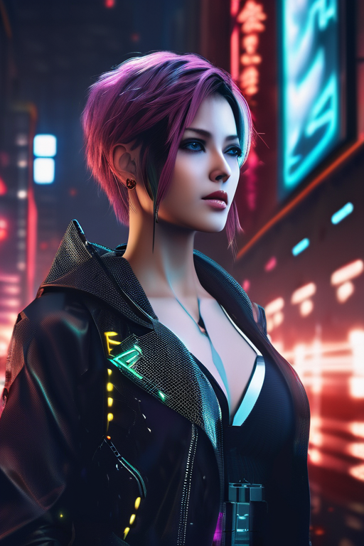
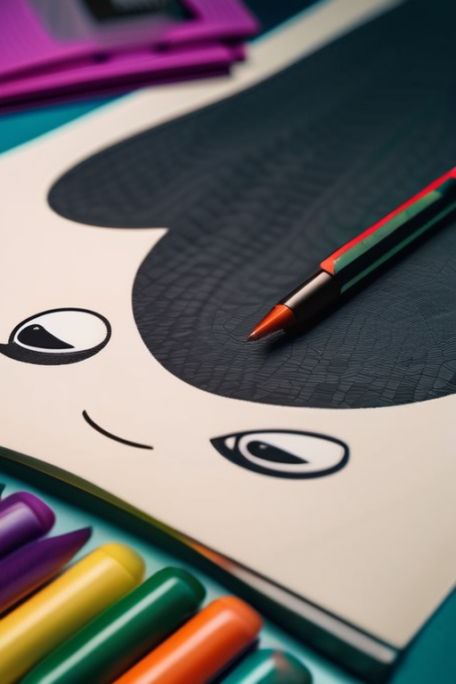
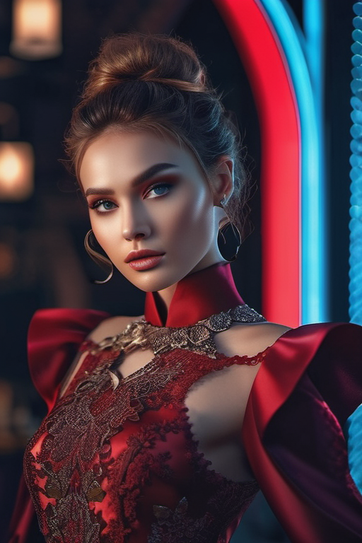
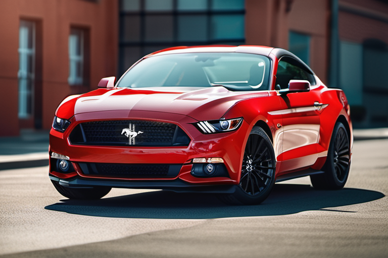

# Prompt Templates for Stable Diffusion

## Disclaimer
Do these prompts only work with Stable Diffusion? No, they can also be used for [Midjourney](https://www.midjourney.com/), [DALL·E 2](https://openai.com/dall-e-2/) and other similar projects. In general the results will always depend on the chosen sampling method, dimensions of the image, chosen model and many other factors. The results will be different from the ones shown here, but the overall end results should be in the same ballpark.

It is also to be considered that some prompts will not be working in online (hosted) versions of stable diffusion or other equivalents as there might be some restrictions for reasons like political, nudity or others.

## Purpose of this document
The following prompts are supposed to give an easier entry into getting good results in using [Stable Diffusion](https://github.com/CompVis/stable-diffusion). Simple prompts can already lead to good outcomes, but sometimes it's in the details on what makes an image believable. The following prompts are mostly collected from different discord servers, websites, fabricated and then modified to match the _best_ results. Some sources for good prompts are [r/StableDiffusion](https://www.reddit.com/r/StableDiffusion/), [lexica.art](https://lexica.art/) or [prompthero.com](https://prompthero.com/). 

## Setup
There are several good instructions on how to set up stable diffusion either at [CompVis/stable-diffusion](https://github.com/CompVis/stable-diffusion), [r/StableDiffusion/wiki/guide/](https://www.reddit.com/r/StableDiffusion/wiki/guide/) or [rentry.org/voldy](https://rentry.org/voldy).

## Usage
Copy the prompt from the category you want to start with and replace the `{{Prompt}}` part, or any other part in `{{brackets}}` with your personal prompt command. Then feel free to update the prompt to match your vision. All provided prompts can be used both for **txt2img** and **img2img**.

The outcome will differ depending on the used model. While there are already differences between stable diffusion v1, v1.5 or v2, there are other models which have been trained on more specific sets of images to resemble certain styles (comic, photograph, specific video games, ...) or improve a certain astetic. Most of these alternative models can also be found on [huggingface.co](https://huggingface.co/) and popular examples would be

* [Openjourney v2](https://huggingface.co/prompthero/openjourney-v2)
* [Waifu Diffusion](https://huggingface.co/hakurei/waifu-diffusion)
* [Arcane Diffusion](https://huggingface.co/nitrosocke/Arcane-Diffusion)
* [Redshift Diffusion](https://huggingface.co/nitrosocke/redshift-diffusion)

|                         | DDIM                                                                                        | Euler a                                                                                         |
|-------------------------|---------------------------------------------------------------------------------------------|-------------------------------------------------------------------------------------------------|
| *Stable Diffusion v1*   |    |    |
| *Stable Diffusion v2.1* |  |  |
| *Open Journey v2*       |    |    |
| *Arcane Diffusion*      |    |    |

## Contribute
This is a public document and is by far not perfect or complete. If you want to contribute by adding a new category or improving an existing prompt, simply open a pull request with your changes, and we will include those as well. If you update an existing category, please ensure that the provided example image has been generated using the exact prompt. To ensure the integrity between the prompt and the image, please also provide the sample information file.

## Prompts

| Category              | Prompt                                                                                                                                                                                                                                                                                                                                                                                                                          | Example                                                                   |
|-----------------------|---------------------------------------------------------------------------------------------------------------------------------------------------------------------------------------------------------------------------------------------------------------------------------------------------------------------------------------------------------------------------------------------------------------------------------|---------------------------------------------------------------------------|
| Animal                | `{{Prompt}}`, wildlife photography, photograph, high quality, wildlife, f 1.8, soft focus, 8k, national geographic, award - winning photograph by nick nichols                                                                                                                                                                                                                                                                  |                                |
| Archviz               | `{{Prompt}}`, by James McDonald and Joarc Architects, home, interior, octane render, deviantart, cinematic, key art, hyperrealism, sun light, sunrays, canon eos c 300, ƒ 1.8, 35 mm, 8k, medium - format print                                                                                                                                                                                                                 |                              |
| Building              | `{{Prompt}}`, shot 35 mm, realism, octane render, 8k, trending on artstation, 35 mm camera, unreal engine, hyper detailed, photo - realistic maximum detail, volumetric light, realistic matte painting, hyper photorealistic, trending on artstation, ultra - detailed, realistic                                                                                                                                              |                            |
| Cartoon Character     | `{{Prompt}}`, anthro, very cute kid's film character, disney pixar zootopia character concept artwork, 3d concept, detailed fur, high detail iconic character for upcoming film, trending on artstation, character design, 3d artistic render, highly detailed, octane, blender, cartoon, shadows, lighting                                                                                                                     |                              |
| Concept Art / Design  | `{{Prompt}}`, character sheet, concept design, contrast, style by kim jung gi, zabrocki, karlkka, jayison devadas, trending on artstation, 8k, ultra wide angle, pincushion lens effect                                                                                                                                                                                                                                         |                              |
| Cyberpunk             | `{{Prompt}}`, cyberpunk, in heavy raining futuristic tokyo rooftop cyberpunk night, sci-fi, fantasy, intricate, very very beautiful, elegant, neon light, highly detailed, digital painting, artstation, concept art, soft light, hdri, smooth, sharp focus, illustration, art by tian zi and craig mullins and wlop and alphonse much                                                                                          |                          |
| Digital Art           | `{{Prompt}}`, ultra realistic, concept art, intricate details, highly detailed, photorealistic, octane render, 8k, unreal engine, sharp focus, volumetric lighting unreal engine. art by artgerm and alphonse mucha                                                                                                                                                                                                             |                      |
| Digital Art Landscape | `{{Prompt}}`, epic concept art by barlowe wayne, ruan jia, light effect, volumetric light, 3d, ultra clear detailed, octane render, 8k, dark green, `{{colors}}` colour scheme                                                                                                                                                                                                                                                  |  |
| Drawing               | `{{Prompt}}`, cute, funny, centered, award winning watercolor pen illustration, detailed, disney, isometric illustration, drawing, by Stephen Hillenburg, Matt Groening, Albert Uderzo                                                                                                                                                                                                                                          |                              |
| Fashion               | photograph of a Fashion model, `{{Prompt}}`, full body, highly detailed and intricate, golden ratio, vibrant colors, hyper maximalist, futuristic, city background, luxury, elite, cinematic, fashion, depth of field, colorful, glow, trending on artstation, ultra high detail, ultra realistic, cinematic lighting, focused, 8k,                                                                                             |                              |
| Landscape             | `{{Prompt}}`, birds in the sky, waterfall close shot 35 mm, realism, octane render, 8 k, exploration, cinematic, trending on artstation, 35 mm camera, unreal engine, hyper detailed, photo - realistic maximum detail, volumetric light, moody cinematic epic concept art, realistic matte painting, hyper photorealistic, epic, trending on artstation, movie concept art, cinematic composition, ultra - detailed, realistic |                          |
| Photograph Closeup    | `{{Prompt}}`, depth of field. bokeh. soft light. by Yasmin Albatoul, Harry Fayt. centered. extremely detailed. Nikon D850, (35mm&#124;50mm&#124;85mm). award winning photography.                                                                                                                                                                                                                                               |        | 
| Photograph Portrait   | portrait photo of `{{Prompt}}`, photograph, highly detailed face, depth of field, moody light, golden hour, style by Dan Winters, Russell James, Steve McCurry, centered, extremely detailed, Nikon D850, award winning photography                                                                                                                                                                                             |      |
| Postapocalyptic       | `{{Prompt}}`, fog, animals, birds, deer, bunny, postapocalyptic, overgrown with plant life and ivy, artgerm, yoshitaka amano, gothic interior, 8k, octane render, unreal engine                                                                                                                                                                                                                                                 |              |
| Schematic             | 23rd century scientific schematics for `{{Prompt}}`, blueprint, hyperdetailed vector technical documents, callouts, legend, patent registry                                                                                                                                                                                                                                                                                     |                          |
| Sketch                | `{{Prompt}}`, sketch, drawing, detailed, pencil, black and white by Adonna Khare, Paul Cadden, Pierre-Yves Riveau                                                                                                                                                                                                                                                                                                               |                                |
| Space                 | `{{Prompt}}`, by Andrew McCarthy, Navaneeth Unnikrishnan, Manuel Dietrich, photo realistic, 8 k, cinematic lighting, hd, atmospheric, hyperdetailed, trending on artstation, deviantart, photography, glow effect                                                                                                                                                                                                               |                                  |
| Sprite                | sprite of video games `{{Prompt}}` icons, 2d icons, rpg skills icons, world of warcraft, league of legends, ability icon, fantasy, potions, spells, objects, flowers, gems, swords, axe, hammer, fire, ice, arcane, shiny object, graphic design, high contrast, artstation                                                                                                                                                     |                                |
| Steampunk             | `{{Prompt}}`, steampunk cybernetic biomechanical, 3d model, very coherent symmetrical artwork, unreal engine realistic render, 8k, micro detail, intricate, elegant, highly detailed, centered, digital painting, artstation, smooth, sharp focus, illustration, artgerm, Caio Fantini, wlop                                                                                                                                    |                          |
| Vehicles              | photograph of `{{Prompt}}`, photorealistic, vivid, sharp focus, reflection, refraction,  sunrays, very detailed, intricate, intense cinematic composition                                                                                                                                                                                                                                                                       |                              |
